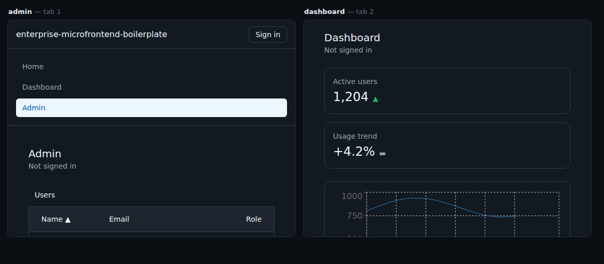

# enterprise-microfrontend-boilerplate

[](https://github.com/rodvieira/enterprise-microfrontend-boilerplate/actions/workflows/ci.yml)
[](https://enterprise-microfrontend-boilerplate.vercel.app/)
[](LICENSE)
[](https://pnpm.io/)

A production-grade starting point for large, scalable React applications
built on micro-frontend architecture — [Module Federation
2.0](https://module-federation.io/), via [Rspack](https://rspack.rs/).
Ships two real, working micro-frontends — a dashboard and an admin panel —
composed inside a shell, sharing a design system and an authentication
contract, talking to each other through a typed event bus. A scaffolding
generator (`pnpm turbo gen remote`) produces a third remote either inside
this monorepo or as a standalone, independently-deployable repository.

## Why this exists

Every existing micro-frontend starter in the ecosystem is either a full
framework you adopt wholesale, a mature-but-dated router with no real
domain example, or a set of generators locked inside one specific monorepo
tool's ecosystem — usually with toy demos (a shop, a cart, a list of
characters) that prove the mechanics but never the operational concerns a
real second team hits: shared auth, dependency version drift, import
boundary violations, or what actually happens the day a second remote gets
built by people who didn't write the first one.

This project ships two working remotes instead of one, specifically
because the second one is what proves a convention actually generalizes
rather than merely happening to work once. It is not a full framework (no
proprietary vocabulary, no hosted cloud service), not locked to one
monorepo tool (every remote is independently deployable — see
[ADR-0007](docs/decisions/0007-monorepo-and-standalone-parity.md)), and it
does not implement real authentication — it ships a stable contract
instead of a login flow, deliberately (see
[ADR-0009](docs/decisions/0009-auth-contract-not-implementation.md)).

## What's actually running

- **`apps/shell`** — the host. Reads a per-environment remote registry
  and composes federated regions into one application; exposes nothing of
  its own over federation.
- **`apps/dashboard`** — KPI cards, an activity chart, and a recent
  activity feed, exposed over Module Federation as `./App`.
- **`apps/admin`** — a paginated user table and an invite/edit modal.
  Changing a user's role there publishes an event through
  `packages/event-bus` that `apps/dashboard` subscribes to, updating its
  "active users" KPI live — no reload, no direct import between the two
  remotes. This is this project's headline proof that the architecture
  works end-to-end, not just that two apps can be loaded side by side.
- **`pnpm turbo gen remote`** — a generator extracted from what
  `apps/dashboard` and `apps/admin` actually share (not designed ahead of
  them), producing a third remote either inside this monorepo or as a
  fully independent, standalone project consuming `packages/*` as
  published dependencies.
- **Guard rails in CI** that catch the two bugs that actually break
  micro-frontend architectures in production: `pnpm check:shared-deps`
  (dependency version drift across the shell and every remote) and
  `pnpm check:boundaries` (`dependency-cruiser`, the `exposed/`/`internal/`
  import boundary) — plus real dependency/CVE scanning and a
  Content-Security-Policy derived from the shell's own runtime origin
  allow-list.

## Demo & live URLs



Two browser tabs. Changing a role in **admin** moves **dashboard**'s
"active users" KPI — across a tab boundary, with no reload, no shared
global, and no import between the two remotes. The update travels only
through the typed event bus.

Live: <https://enterprise-microfrontend-boilerplate.vercel.app/>
— the shell composing the real `apps/dashboard` and `apps/admin` remotes,
deployed to Vercel (see
[ADR-0026](docs/decisions/0026-vercel-over-github-pages.md)).
[docs/how-to-deploy.md](docs/how-to-deploy.md) covers deploying to your
own static host.

## Quick start

```bash
pnpm install
pnpm dev
```

Visit `http://localhost:3000` — the shell composes both remotes
automatically. `/dashboard` and `/admin` are both live; switch users'
roles in admin and watch dashboard's "active users" KPI update in the
other tab, live.

## Adopting this for your own company

`dashboard` and `admin` exist to prove the conventions generalize — they
are examples, not something you ship. When you are ready to make this
repository yours:

```bash
pnpm eject --scope @acme --first-remote payments
```

That renames the `@enterprise-mfe` scope to yours, scaffolds your first
real remote in place of the two examples, and removes the artifacts of
*this* project's build process (its specs, ADRs, and blueprint). It runs
once, then deletes itself, and writes `EJECT-TODO.md` listing what a
script should not decide for you — mostly prose that still describes the
example remotes.

Run it on a clean working tree: `git reset --hard` is the undo, and the
command refuses to start without one.

## Stack, and why

Every choice below is recorded as an ADR, including the ones that were
decided *against* doing something.

| Layer | Choice | Decision |
|---|---|---|
| Bundler | Rspack | [ADR-0002](docs/decisions/0002-rspack-over-vite.md) |
| Federation | Module Federation 2.0 | [ADR-0003](docs/decisions/0003-module-federation-2.md) |
| UI | React + TypeScript + Tailwind | [ADR-0004](docs/decisions/0004-react-typescript-tailwind.md) |
| Monorepo | pnpm + Turborepo | [ADR-0005](docs/decisions/0005-pnpm-turborepo.md) |
| Module boundary | `exposed/` vs `internal/` | [ADR-0006](docs/decisions/0006-exposed-internal-boundary.md) |
| Remote portability | Monorepo *and* standalone parity | [ADR-0007](docs/decisions/0007-monorepo-and-standalone-parity.md) |
| Auth | A contract, not a login flow | [ADR-0009](docs/decisions/0009-auth-contract-not-implementation.md) |
| Remote discovery | Registry fetched at runtime | [ADR-0012](docs/decisions/0012-runtime-registry-fetch.md) |
| Packaging | `publishConfig.exports` → `dist/` | [ADR-0020](docs/decisions/0020-packages-build-for-publishing.md) |
| Adoption | `pnpm eject` | [ADR-0021](docs/decisions/0021-eject-adoption-path.md) |
| Rollback | Optional `version` per remote | [ADR-0022](docs/decisions/0022-registry-version-and-rollback.md) |
| Observability | A contract, not a vendor | [ADR-0023](docs/decisions/0023-telemetry-contract.md) |
| CSS | Per-app Tailwind, version guarded | [ADR-0024](docs/decisions/0024-css-isolation.md) |
| Cross-tab events | Validated at the receiving edge | [ADR-0025](docs/decisions/0025-cross-tab-payload-validation.md) |
| Deployment | One Vercel project, rewrites for SPA routes | [ADR-0026](docs/decisions/0026-vercel-over-github-pages.md) |

## Learn more

- **[docs/blueprint.html](docs/blueprint.html)** — the complete technical
  spec: product overview, every key decision and the evidence behind it,
  competitive gap analysis, and the full sprint-by-sprint build order.
- **[docs/architecture.md](docs/architecture.md)** — the contributor-facing
  architecture reference: the remote registry, remote loading, cross-remote
  communication, and boundary enforcement.
- **[docs/decisions/](docs/decisions/)** — every architectural decision
  this project has made, as an ADR, with the reasoning and evidence behind
  each one — never edited after the fact, only superseded.
- **[CONTRIBUTING.md](CONTRIBUTING.md)** — the rules that matter most,
  before opening a PR.

## License

MIT — see [LICENSE](LICENSE).
